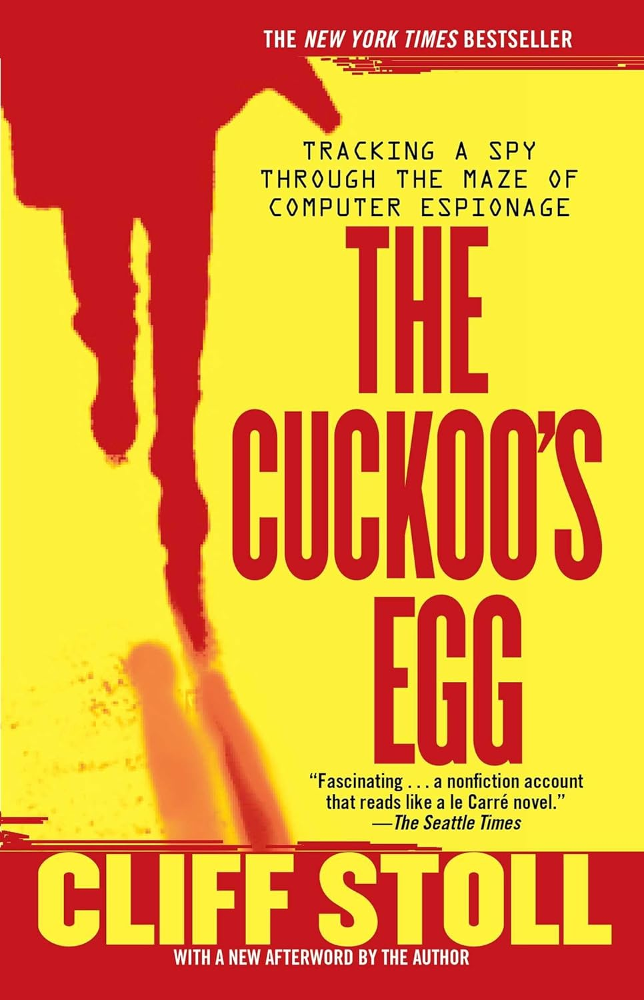
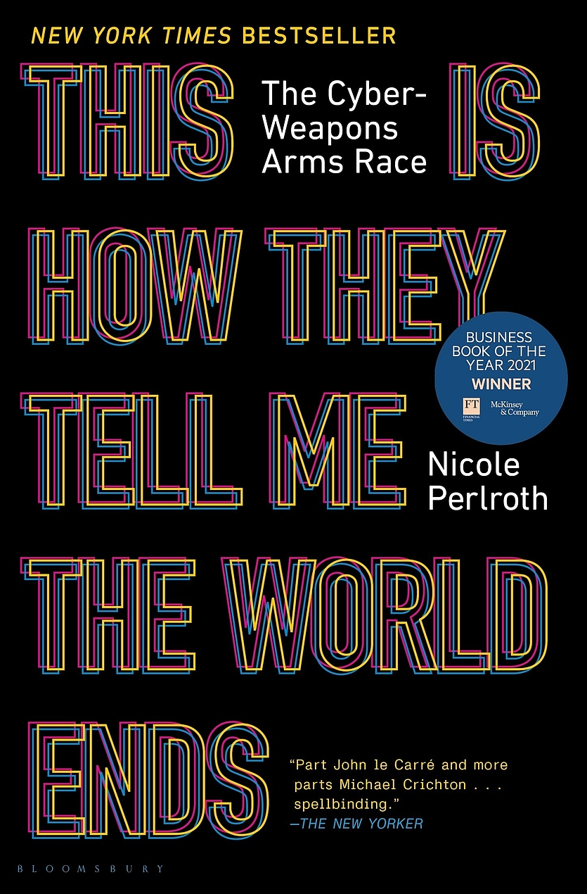
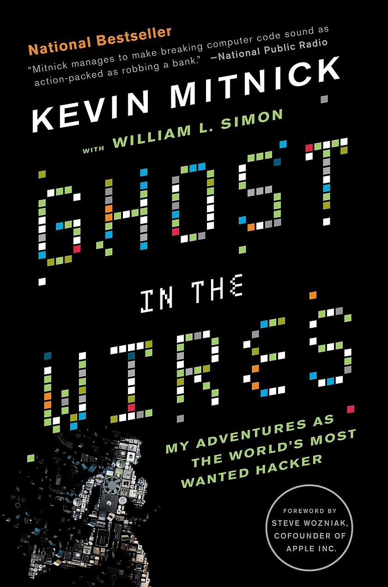

---
mermaid:
  themeVariables:
    lineColor: "#fff"
---

From Passion to Profession: <!-- .element style="font-family:'Nanum Pen Script'; font-size:1.8em;color:green;vertical-align:top;font-weight:500;" -->

#### Exploring Careers in Infosec

---

### whoami

- Cloud Security Engineer
- CKA, CKS, AWS Security Specialty
- https://daemondiaries.com

---

### demo - phishing attack

---

### demo - windows exploit (full admin) - blue

---

### Where to start

- [Get an Epic Cyber Education for Free! (Almost!) With Carrie Roberts - YouTube](https://www.youtube.com/watch?v=ahY49-oIbxw&list=PL-4fuTjKox5cwCMqov_tjwp-aQrihYUYZ&index=14)
- [OWASP Juice Shop | OWASP Foundation](https://owasp.org/www-project-juice-shop/)
- [OWASP WebGoat | OWASP Foundation](https://owasp.org/www-project-webgoat/)
- [Wargames - UnderTheWire](https://underthewire.tech/wargames)
- [OverTheWire: Wargames](https://overthewire.org/wargames/)

---

### CTFs, YouTube channels

- [CTFtime.org / All about CTF (Capture The Flag)](https://ctftime.org/)
- [picoCTF - CMU Cybersecurity Competition](https://picoctf.org/)
- [IppSec - YouTube](https://www.youtube.com/channel/UCa6eh7gCkpPo5XXUDfygQQA)
- [LiveOverflow - YouTube](https://www.youtube.com/channel/UClcE-kVhqyiHCcjYwcpfj9w)

---

### bug bounties

- [HackerOne | #1 Trusted Security Platform and Hacker Program](https://www.hackerone.com/)
- [#1 Crowdsourced Cybersecurity Platform | Bugcrowd](https://www.bugcrowd.com/)
- [Free Bug Bounty Program and Coordinated Vulnerability Disclosure | Open Bug Bounty](https://www.openbugbounty.org/)

---

### opensecurity2

## [Courses | OpenSecurityTraining2](https://p.ost2.fyi/courses)

---

### books that helped

- Code: The Hidden Language of Computer Hardware and Software - Charles Petzold
- Penetration Testing: A hands-on introduction to Hacking - Georgia Weidman

---

### certifications

- [Security Certification Roadmap - Paul Jerimy Media](https://pauljerimy.com/security-certification-roadmap/)
- [Security+ (Plus) Certification | CompTIA IT Certifications](https://www.comptia.org/certifications/security)

---

### fields and career roles

---

### hacker mindset (books, quotes etc )

<grid drag="100 100" flow="row">
  

    

    

    

    

    

  

</grid>

---
